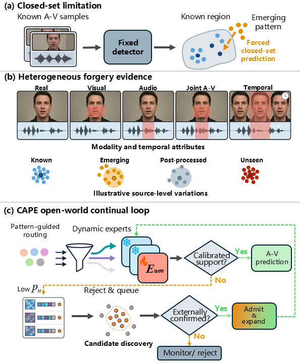
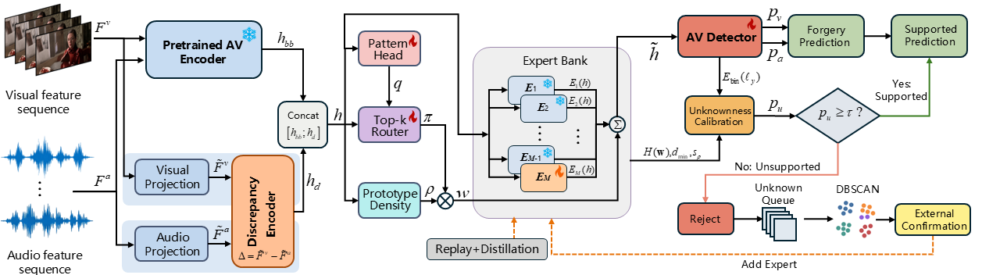

# CAPE: Continual Audio-Visual Pattern Experts for Open-World Deepfake Detection

Official research implementation accompanying the CAPE manuscript.

CAPE studies **open-world pattern-incremental audio-visual deepfake detection**. At inference time, the model is not given task, stage, forgery-pattern, or generator identity. It combines discrepancy-conditioned expert routing, prototype support, conformal unknown detection, candidate discovery, and controlled expert expansion.

## Open-World Setting



*Closed-set limitations, heterogeneous audio-visual forgery evidence, and the CAPE open-world continual loop.*

## CAPE Architecture



*Weak forensic attributes and prototype density guide support-aware expert routing. Composite evidence enables conformal rejection, while externally confirmed candidate patterns trigger controlled expert expansion.*

## Highlights

- Task-free routing over a dynamic bank of pattern experts.
- Audio-visual discrepancy modeling with modality and temporal pattern attributes.
- Prototype-density support verification independent of router confidence.
- Conformal calibration for supported/unsupported prediction decisions.
- Unknown-sample queue, candidate clustering, and confirmation-gated expansion.
- Continual adaptation with replay, distillation, and frozen previous experts.
- Four-fold open-world discovery/adaptation protocol and continual-learning metrics.

## Repository Layout

```text
src/
  cape_models.py       CAPE model and training losses
  cape_experts.py      dynamic expert bank
  cape_router.py       task-free discrepancy-conditioned router
  cape_unknown.py      conformal unknown detector and queue
  cape_logic.py        weak forensic pattern supervision
  cape_continual.py    replay/distillation continual trainer
  cape_metrics.py      continual and open-world metrics
  cape_memory.py       replay and calibration reservoirs

scripts/
  cape_build_metadata.py
  cape_pattern_incremental.py
  cape_pattern_incremental_av1M.py
  cape_smoke_test.py
  cape_experiments/
    audit_avhubert_features.py
    run_open_world_protocol.py
```

## Setup

```bash
git clone https://github.com/Cero529/CAPE.git
cd CAPE
conda create -n cape python=3.10
conda activate cape
pip install -r requirements.txt
```

## Feature and Metadata Contract

Each paper-profile NPZ feature file must contain:

- `video_features`
- `audio_features`
- `backbone_features`: frozen AV-HuBERT final multimodal sequence or pooled 768-dimensional representation
- either scalar `valid_length` or a contiguous-prefix `pair_valid_mask`

The unified metadata CSV uses:

```text
sample_id,dataset,feature_path,split,
video_target,audio_target,is_fake,
pattern_id,task_id,generator,fake_periods
```

Audit the feature files before a paper run:

```bash
python scripts/cape_experiments/audit_avhubert_features.py \
  --metadata data/cape_metadata.csv \
  --report results/avhubert_feature_audit.json
```

## Quick Check

```bash
python scripts/cape_smoke_test.py
```

Expected output:

```text
CAPE smoke test passed
```

## Experiments

Build unified metadata:

```bash
python scripts/cape_build_metadata.py --root . --output data/cape_metadata.csv
```

Run pattern-incremental training:

```bash
python scripts/cape_pattern_incremental.py --metadata data/cape_metadata.csv
```

Run the AV-Deepfake1M paper profile:

```bash
python scripts/cape_pattern_incremental_av1M.py --epochs 20
```

Run the four-fold open-world protocol:

```bash
python scripts/cape_experiments/run_open_world_protocol.py --help
```

Detailed implementation notes are available in [CAPE_README.md](CAPE_README.md) and [scripts/cape_experiments/README.md](scripts/cape_experiments/README.md).

